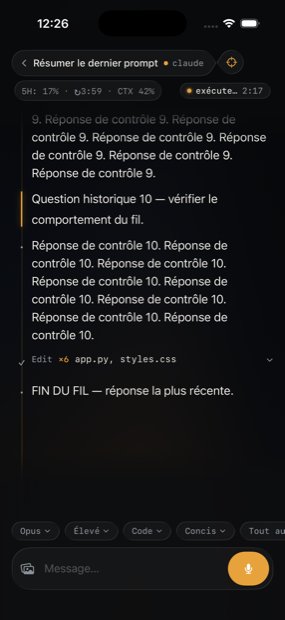
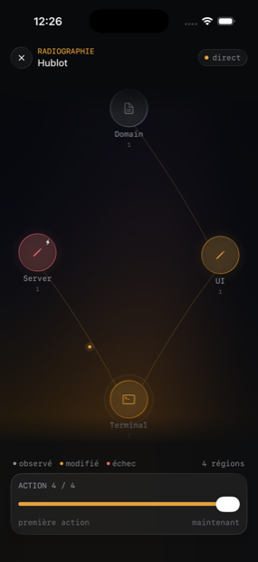
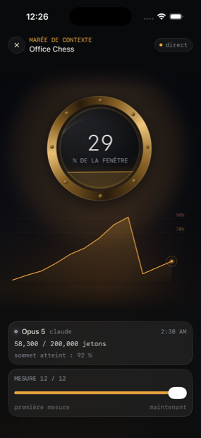
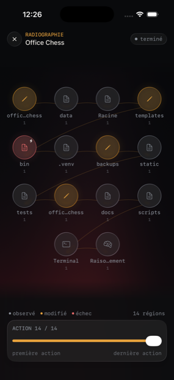
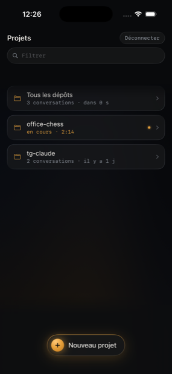
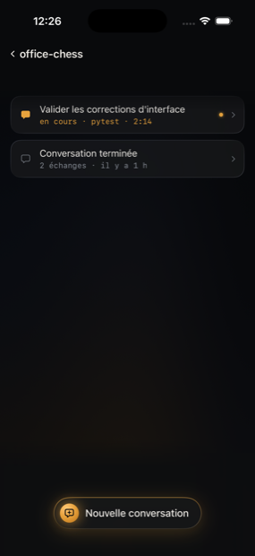
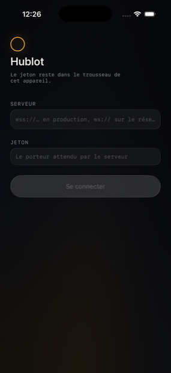

# Hublot

Client iOS natif pour piloter **Claude Code** et **Codex** sur un VPS, depuis le
téléphone. Une vraie app, pas une fenêtre de terminal : le fil se lit comme une
conversation, les outils se replient, et l'état de la machine se voit à un mètre
de l'écran.

<p align="center">
  
  
  
</p>

## Le problème

Un agent de codage tourne sur un serveur, pas sur le téléphone. Pour le piloter
en mobilité il faut un relais — et le relais historique, ici, était Telegram
([`tg-claude`](https://github.com/antoinemalinur/tg-claude)). Telegram sait
afficher un message fini ; il ne sait pas montrer une réponse qui s'écrit, un
tableau, un diff, ni ce que l'agent est en train de faire depuis deux minutes.

Hublot remplace l'interface, **sans dupliquer le cerveau du relais**. Les
quotas, les passations entre moteurs, les permissions et les sessions natives
restent assurés par `tg-claude` ; Hublot ajoute le transport, le streaming et le
rendu.

## Deux dépôts, un seul répertoire

C'est le point à comprendre avant de reprendre le projet.

| Dépôt | Contenu | Rôle |
|---|---|---|
| **hublot** (celui-ci) | l'app iOS + `Server/acp_server.py`, `continuity.py`, `sessions.py`, `usage.py`, `radiography.py` | le transport ACP, le streaming, le fil commun, les mesures |
| [**tg-claude**](https://github.com/antoinemalinur/tg-claude) | `bot.py`, `handoff.py`, `confirm_hook.py`, `render.py` | la logique historique : quotas, bascule de moteur, garde-fous, état |

Les deux se déploient dans **le même répertoire** du VPS (`/opt/tg-claude` par
défaut, `TG_CLAUDE_BASE` pour en changer). `acp_server.py` y insère ce chemin
dans `sys.path` puis importe `bot` et `handoff` directement :

```python
BASE = os.environ.get("TG_CLAUDE_BASE", "/opt/tg-claude")
sys.path.insert(0, BASE)

import bot            # ← appartient à tg-claude
import handoff        # ← appartient à tg-claude
import continuity     # ← appartient à ce dépôt
```

**Ce dépôt ne suffit donc pas à faire tourner le serveur** : `bot.py` et
`handoff.py` n'y sont pas, et sans eux `acp_server.py` ne démarre pas. Les tests
serveur d'ici les remplacent par des doublures (`Server/test_acp_server.py`),
ce qui permet de tester le contrat de streaming sans installer tout le VPS.

```text
iPhone ──wss──▶ Caddy ──▶ acp_server.py ──▶ claude / codex
                              │
                              ├─ bot.py          tg-claude : quotas, moteurs, état
                              ├─ handoff.py      tg-claude : passation de contexte
                              ├─ sessions.py     conversations natives Claude
                              ├─ continuity.py   fil commun, outils et mesures rejoués
                              ├─ usage.py        contexte relu chez chaque moteur
                              └─ radiography.py  événements Codex localisés
```

## Les écrans

### Conversation

Pas de bulles : le document occupe la fenêtre, le chrome flotte en capsules de
verre. Un rail de lumière à gauche porte l'état de chaque bloc, et tout ce qui
n'est pas de la prose est replié sur une ligne. Le Markdown est rendu pour de
vrai — tableaux, diffs, code coloré — et les appels d'outils répétés sont
regroupés par nature (`Edit ×6 app.py, styles.css`) plutôt qu'empilés à
l'identique.

La barre du haut tient trois mesures que rien d'autre n'affiche : la fenêtre de
quota consommée, le temps avant sa remise à zéro, et le contexte entamé. À
droite, le **signe de vie** du tour : ce que le moteur fait, depuis quand, et
depuis combien de temps il n'a plus rien émis.


### Radiographie

La conversation dépliée en espace : où l'agent est allé, dans quel ordre, et
quel état chaque région a annoncé. Les régions viennent des chemins réellement
touchés, les liens des transitions observées, et une chronologie permet de
rejouer la séance depuis le début.

Elle ne dessine **que des faits mesurés** : ni couverture de tests, ni
dépendances, ni effet supposé d'une commande — ACP n'en dit rien, donc la carte
n'en parle pas. Un échec ancien rattrapé cesse d'alarmer ; une carte figée dans
le passé n'anime rien.

<p>
  
  
</p>

### Marée de contexte

La barre d'état donne un chiffre juste et muet. Cet écran donne la **pente** :
d'où l'on vient, à quelle allure ça monte, et si le palier tient depuis dix
secondes ou dix minutes — la seule chose qui permette de décider s'il faut
compacter maintenant ou finir ce qu'on a commencé. Une compaction s'y lit comme
une retombée, et le sommet franchi reste affiché.

Toucher la barre de statut l'ouvre. Le passé vient du serveur : chaque mesure
est écrite dans le fil commun et rejouée à la réouverture.


### Projets et conversations

Les dépôts du VPS et leurs conversations, avec reprise, création et suppression.
Un tour en cours est visible **avant** d'ouvrir la conversation — sans ça, il
faut entrer dans chaque fil pour savoir lequel travaille.

<p>
  
  
</p>

### Connexion

L'adresse du relais et le jeton porteur. Le jeton part dans le trousseau iOS et
n'en ressort pas.



## Fonctionnalités

- liaison WebSocket persistante, reconnexion silencieuse au retour de veille ;
- **un tour survit à la liaison qui l'a lancé** : le téléphone dort, le moteur
  continue, et la conversation repart en direct sur la liaison qui revient —
  texte déjà écrit compris ;
- **signe de vie** : phase, durée et silence du tour en cours. Sans ce compteur,
  une commande de trois minutes et un moteur planté donnent le même écran ;
- streaming Markdown incrémental (le rendu reste linéaire, pas quadratique),
  coloration syntaxique, tableaux, diffs, outils repliables ;
- retour automatique à la dernière réponse à l'ouverture, bouton de retour au
  direct dès qu'on remonte lire ;
- sélection Claude/Codex, modèles, effort et permissions — tous **décrits par le
  serveur**, jamais codés en dur dans l'app ;
- bascule de moteur avec passation du seul contexte manquant ;
- quotas et contexte relus chez le moteur qui les mesure, donc connus dès
  l'ouverture ;
- envoi de photos : l'image est réduite sur le téléphone, posée sur le VPS, lue
  par le moteur ;
- dictée via Whisper, notifications locales, arrêt d'un tour en cours ;
- messages écrits pendant un tour rangés en file puis envoyés dans l'ordre ;
- demandes de permission avec la commande réelle sous les yeux ;
- lecture du `CLAUDE.md` d'un projet.

## Reprendre le projet

**Prérequis** : Xcode 26, iOS 26, Node.js 20 pour les tests de bout en bout,
Python 3.12+ sur le VPS.

### L'app

```bash
open IAClient-UI.xcodeproj          # ou : xcodebuild -scheme IAClient-UI build
```

Au premier lancement, l'écran de connexion demande l'adresse du relais
(`wss://…`) et le jeton. Rien à configurer dans le dépôt.

Les écrans se rendent **sans serveur**, via des indicateurs de lancement — utile
pour travailler le visuel ou reproduire un cas précis :

| Indicateur | Écran |
|---|---|
| `-HublotConversationDemo 1` | fil déterministe, assez long pour exercer le chrome |
| `-HublotRadiographyDemo 1` | radiographie à quatre régions |
| `-HublotRadiographyDense 1` | radiographie chargée : quatorze régions, fil terminé |
| `-HublotContextTideDemo 1` | marée de contexte, avec une compaction |
| `-HublotProjectsDemo 1` | liste des projets |
| `-HublotSessionsDemo 1` | liste des conversations |

### Le serveur

Il lui faut `tg-claude` à côté : cloner les deux dépôts **dans le même
répertoire**.

```bash
git clone https://github.com/antoinemalinur/tg-claude /opt/tg-claude
cp Server/*.py /opt/tg-claude/
systemctl restart acp.service
```

Variables d'environnement lues par `acp_server.py` :

| Variable | Défaut | Rôle |
|---|---|---|
| `TG_CLAUDE_BASE` | `/opt/tg-claude` | où trouver `bot.py` et `handoff.py` |
| `ACP_HOST` / `ACP_PORT` | `127.0.0.1` / `8325` | écoute WebSocket (TLS délégué à Caddy) |
| `ACP_TOKEN` | — | jeton porteur attendu ; sans lui, rien n'est accepté |
| `ACP_CONTINUITY` | `/opt/tg-claude/state/acp-continuity` | fils communs, outils et mesures |
| `CLAUDE_CODE_OAUTH_TOKEN` | — | **doit rester exporté** dans l'unité du service |

Ce dernier n'est pas lu par `acp_server.py` : il est lu par le `claude` qu'il
lance. Sans lui, le CLI retombe sur la session OAuth de
`~/.claude/.credentials.json` — qui expire, ne se renouvelle pas toujours, et
fait alors mourir **tous** les tours Claude sur « OAuth session expired and
could not be refreshed », pendant que le relais Telegram, lui, continue de
répondre. Le serveur annonce au démarrage laquelle des deux sources il aura :

```text
[acp] authentification Claude : jeton d'environnement
```

### Les deux identités, et pourquoi il en faut deux

Le VPS porte **deux** identifiants Claude, et chacun sert à une chose :

| | Ce qu'il permet | Ce qu'il ne permet pas |
|---|---|---|
| `CLAUDE_CODE_OAUTH_TOKEN` (`claude setup-token`) | faire tourner les moteurs, indéfiniment | lire `/usage` — il ferme la commande |
| session `claude.ai` (`claude auth login`) | lire `/usage`, donc la jauge | rien : elle peut expirer sans se renouveler |

Le jeton l'emporte sur la session dès qu'il est présent dans l'environnement.
`acp_server.py` l'écarte donc **pour le seul appel de quota**, et le garde pour
tout le reste. C'est délibéré : une session qui meurt ne coûte alors que la
jauge, jamais le moteur — l'inverse exact du 8 août 2026, où sa mort a fait
tomber tous les tours.

### D'où viennent les plafonds

Chaque moteur est interrogé directement, sans service intermédiaire :

| Moteur | Source | Réseau |
|---|---|---|
| Codex | `codex app-server` → `account/rateLimits/read` | aucun |
| Claude | `claude -p /usage` | oui, `/api/oauth/usage` |

Claude n'a pas d'autre voie : en mode `--print` le CLI n'appelle jamais la
statusline — le canal qui alimente la barre d'un terminal — et son flux ne porte
qu'une alarme au-delà de 75 %, pas un compteur. Cet endpoint bannit pour un quart
d'heure au moindre excès, d'où le cache de 15 minutes ; Codex, local et gratuit,
se contente de 5 minutes pour ne pas lancer un processus toutes les 8 secondes.

La sortie de `/usage` est de la prose anglaise, sans forme structurée, et deux
versions du CLI l'écrivent déjà différemment (« Aug 8 at 9:10pm » et « Aug 8,
9:10pm »). Le parseur tolère les deux, et un reset illisible ne fait pas perdre
le pourcentage.

## Tests

Le projet impose qu'une correction arrive avec son test de régression, et qu'un
comportement tactile soit exercé par un vrai test d'interface — pas seulement
par une compilation.

```bash
# Tout : tests unitaires, 102 tests d'interface, couverture, serveur, Release
Tools/test-local.sh full

# 72 tests serveur, sans VPS (bot.py et handoff.py sont doublés)
cd Server && python3 -m unittest discover

# 20 scénarios contre le vrai serveur ; --fast en saute les 10 qui
# appellent réellement un moteur et consomment du quota
HUBLOT_TOKEN=… node Tools/e2e.mjs --fast
HUBLOT_TOKEN=… node Tools/e2e.mjs --only=vol
```

### Voir un écran témoin à l'œil nu

Chaque test d'interface part d'un **état déterministe** : un écran nommé, rendu
toujours à l'identique, sans réseau. Ils servent aussi à regarder un écran sans
avoir à reproduire les conditions qui y mènent — un jeton refusé, un moteur muet
depuis une minute, une carte sans la moindre région.

```bash
xcrun simctl launch --terminate-running-process booted antoinemalinur.IAClient-UI \
  -HublotUITestScenario chrome-lost
```

Les états disponibles sont déclarés dans `IAClient-UI/App/UITestScenario.swift`,
et construits dans `App/ScreenFixtures.swift` et `App/ThreadFixtures.swift` :

| Famille | États |
|---|---|
| Connexion | `connection`, `connection-busy`, `connection-failure` |
| Dépôts | `projects`, `projects-variants`, `projects-empty`, `projects-error`, `projects-prompt-age`, `projects-reload` |
| Conversations | `sessions`, `sessions-variants`, `sessions-empty`, `sessions-error`, `sessions-instructions`, `sessions-instructions-long`, `sessions-reload` |
| Fil | `conversation`, `conversation-working`, `conversation-age`, `thread-blocks`, `thread-growing`, `concurrent-conversations` |
| Chrome | `chrome-plan`, `chrome-lost`, `chrome-quiet`, `chrome-reconnecting`, `chrome-silent`, `codex-quota`, `engine-switch-quota`, `active-engine-lock` |
| Composer | `composer-attachment`, `composer-refused-mic` |
| Analyse | `context-tide`, `context-tide-empty`, `context-tide-finished`, `radiography`, `radiography-dense`, `radiography-empty` |
| Attente | `holding-launch`, `holding-reconnect` |
| Navigation | `navigation` |

Trois arguments les accompagnent : `-HublotSnapshotMode YES` fige les animations
pour les références visuelles, `-HublotHoldingDelay <s>` raccourcit l'attente
avant l'issue de secours, et `-HublotGrowingDelay <s>` recule l'arrivée du tour
supplémentaire de `thread-growing`.

## Outils

| Commande | Rôle |
|---|---|
| `node Tools/acp-probe.mjs` | Inspecte les capacités réellement annoncées par l'agent. |
| `node Tools/e2e.mjs [--fast] [--only=…]` | Batterie de bout en bout contre le VPS. |
| `node Tools/radiography-e2e.mjs` | Vérifie localisation et reconnexion sur un vrai dépôt. |
| `Tools/ui-check.sh` | Pose une demande par le chemin de l'interface. |
| `Tools/deploy-iphone.sh` | Construit signé, installe et lance sur l'iPhone. |
| `swift Tools/make-icon.swift` | Régénère l'icône de l'app. |

## Sécurité et déploiement

- Le jeton ACP vit dans le trousseau iOS, jamais dans le dépôt.
- Le serveur borne les répertoires pilotés à `/root/repos`.
- Les commandes dangereuses passent par le garde-fou de `tg-claude`.
- La clé de transcription reste dans l'environnement du VPS.
- Le téléphone reçoit la version courante par `Tools/deploy-iphone.sh` ; le
  relais par `scp Server/*.py hetzner:/opt/tg-claude/` puis
  `systemctl restart acp.service`.
- Le profil Apple gratuit expire après 7 jours : passé ce délai le lancement
  échoue sur une erreur de provisioning, et il faut rouvrir Xcode une fois pour
  le renouveler.

## Le code

- `IAClient-UI/ACP/` — JSON-RPC, schéma ACP, transport WebSocket.
- `IAClient-UI/Domain/` — conversation, streaming, notifications, dictée, et les
  projections de la Radiographie et de la Marée.
- `IAClient-UI/UI/` — projets, sessions, conversation, cartes visuelles.
- `IAClient-UI/Render/` — thème, Markdown, coloration, hublot et jauge.
- `Server/` — la part serveur qui appartient à ce dépôt.
- `Tools/` — sondes et tests réels du protocole.

Les commentaires du code expliquent **pourquoi** une décision a été prise, et
souvent quel bug l'a imposée. Ils valent la peine d'être lus avant de modifier
une règle qui paraît arbitraire.
